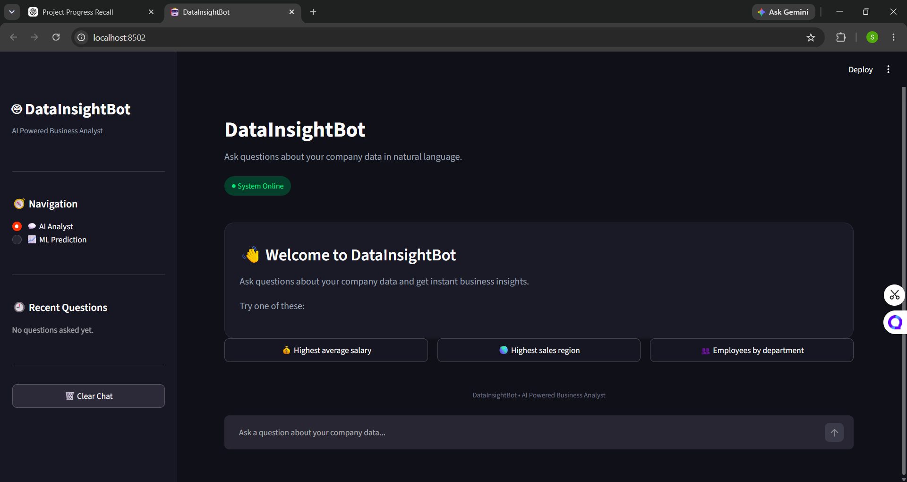
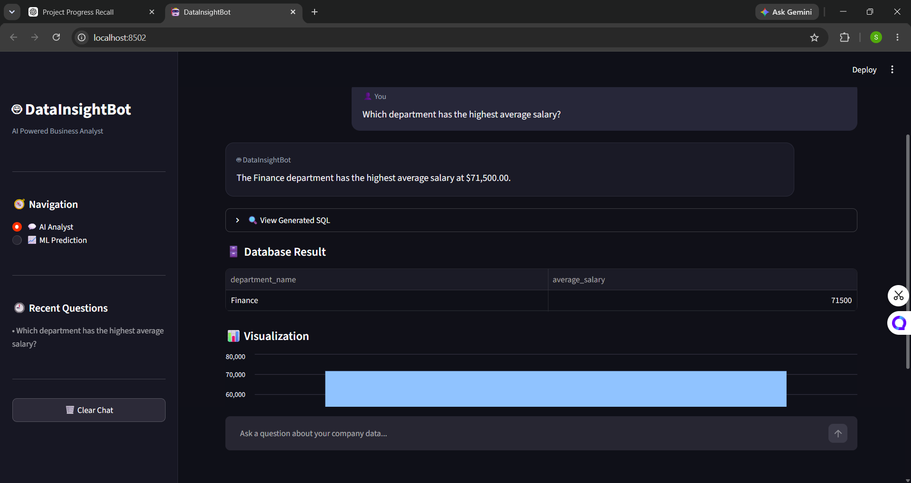
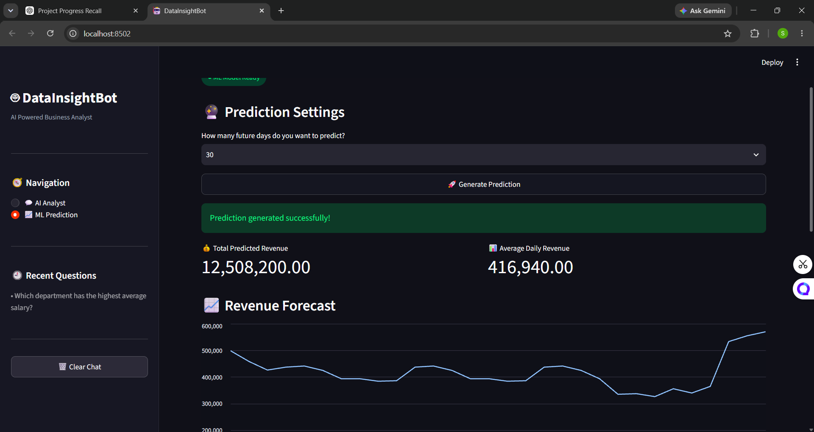

# 📊 DataInsightBot — AI Powered Business Analyst

DataInsightBot is an AI-powered business analytics application that allows users to interact with company data using natural language.

Users can ask business questions such as:

* Which department has the highest average salary?
* Which region generated the highest sales?
* Which project has the highest revenue?

The application uses **Gemini AI** to convert natural-language questions into SQL queries, retrieves data from a **SQLite database**, and generates easy-to-understand business insights.

It also includes a **Machine Learning revenue prediction module** using Random Forest Regression.

---

## 🚀 Features

### 🤖 AI Business Analyst

* Ask questions about company data in natural language.
* Gemini AI converts questions into SQL.
* SQL queries are validated before execution.
* Queries are executed on the SQLite database.
* Gemini generates business-friendly explanations.

### 🔍 SQL Validation

The application allows safe read-only SQL queries and blocks potentially dangerous operations such as:

* INSERT
* UPDATE
* DELETE
* DROP
* ALTER
* CREATE
* TRUNCATE

### 📊 Data Analysis

The application displays:

* Business answers
* Generated SQL
* Database results
* Automatic visualizations

### 📈 Machine Learning Prediction

The application uses **Random Forest Regression** to predict future revenue based on historical sales data.

It provides:

* Revenue predictions
* Average predicted revenue
* Forecast visualization
* Prediction details
* Business insights

---

## 🖥️ Application Screenshots

### 🏠 DataInsightBot Dashboard



### 🤖 AI Business Analysis



### 📈 Machine Learning Revenue Prediction



---

## 🏗️ Architecture

```text
User
  ↓
Streamlit Interface
  ↓
Gemini AI
  ↓
Natural Language → SQL
  ↓
SQL Validator
  ↓
SQLite Database
  ↓
Query Results
  ↓
Gemini Explanation
  ↓
Business Answer + Table + Visualization
```

### ML Pipeline

```text
Historical Sales Data
        ↓
Data Preparation
        ↓
Random Forest Regression
        ↓
Future Revenue Prediction
        ↓
Business Insights
```

---

## 🛠️ Technology Stack

| Technology    | Purpose                         |
| ------------- | ------------------------------- |
| Python        | Core programming                |
| Streamlit     | Web application                 |
| Gemini AI     | SQL generation and explanations |
| SQLite        | Database                        |
| Pandas        | Data processing                 |
| Scikit-learn  | Machine Learning                |
| Random Forest | Revenue prediction              |
| SQL           | Database querying               |

---

## 🗄️ Database

The current project uses a local SQLite database containing demo company data.

### Tables

* **Departments** — department information
* **Employees** — employee information and salaries
* **Projects** — project budgets, revenue and status
* **Sales** — sales, revenue, profit and location data

---

## 🔄 AI Workflow

1. User enters a business question.
2. Gemini generates an SQL query.
3. SQL Validator checks the query.
4. Valid SQL is executed on the SQLite database.
5. Database results are retrieved.
6. Gemini converts the results into a business-friendly explanation.
7. The application displays the answer, SQL, result table and visualization.

---

## 📈 ML Prediction Workflow

1. Historical sales data is loaded.
2. Data is prepared for prediction.
3. A Random Forest Regression model is trained.
4. Future revenue is predicted.
5. Predictions and business insights are displayed.

---

## ▶️ How to Run

### 1. Clone the repository

```bash
git clone https://github.com/soumya-prasad-1/DataInsightBot.git
cd DataInsightBot
```

### 2. Create a virtual environment

```bash
python -m venv .venv
```

### 3. Activate it

Windows:

```bash
.venv\Scripts\activate
```

### 4. Install dependencies

```bash
pip install streamlit pandas scikit-learn google-genai
```

### 5. Add Gemini API Key

Create a `.env` file and add:

```text
GEMINI_API_KEY=your_api_key_here
```

**Never upload the `.env` file to GitHub.**

### 6. Run the application

```bash
streamlit run app.py
```

---

## 💡 Example Questions

```text
Which department has the highest average salary?
```

```text
Which region generated the highest sales?
```

```text
Which project has the highest revenue?
```

```text
Which employee has the highest salary?
```

---

## 📌 Project Scope

This is a **demonstration and learning project** using a local SQLite database and demo company data.

The project focuses on demonstrating:

* Generative AI
* Natural Language to SQL
* Database querying
* Business analytics
* Data visualization
* Machine Learning forecasting

It is **not intended to be a production-level enterprise system**.

---

## 🔮 Future Scope

* Real company database integration
* Advanced forecasting models
* Cloud database integration
* Advanced analytics
* Automated report generation
* Cloud deployment

---

## 👩‍💻 Project

**DataInsightBot — AI Powered Business Analyst**

Built using **Python, Streamlit, Gemini AI, SQLite, Pandas and Scikit-learn.**
